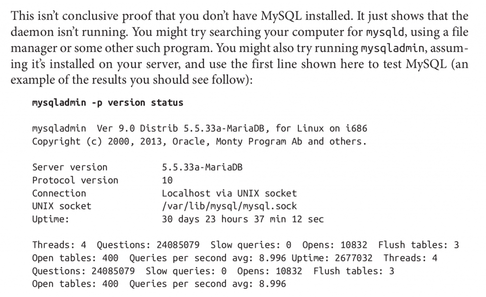

#MariaDB系統信息函數

MariaDB系統信息函數用於查詢MariaDB數據庫的系統信息


1. [VERSION()](#version)
2. [CONNECTION_ID()](#connection_id)
3. [DATABASE(),SCHEMA()](#database_schema)
4. [USER(),SYSTEM_USER(),SESSION_USER()](#user_sysetm_user)
5. [CURRENT_USER(),CURRENT_USER](#current_user)
6. [CHARSET(str)](#charset)
7. [COLLATION(str)](#collation)
8. [LAST_INSERT_ID()](#last_insert_id)
9. [**mysqladmin -p version status**](#mysqladmin_p)

---
<span id="version"></span>
####VERSION()
返回數據庫版本號
```sql
MariaDB [(none)]> select version();
+----------------+
| version()      |
+----------------+
| 5.5.41-MariaDB |
+----------------+
1 row in set (0.00 sec)

MariaDB [(none)]> SELECT VERSION();
+----------------+
| VERSION()      |
+----------------+
| 5.5.41-MariaDB |
+----------------+
1 row in set (0.00 sec)

MariaDB [(none)]>
```

---

<span id="connection_id"></span>
####CONNECTION_ID()
返回服務器連接數
到目前爲止，MariaDB服務的連接次數
```sql
MariaDB [(none)]> select connection_id();
+-----------------+
| connection_id() |
+-----------------+
|               2 |
+-----------------+
1 row in set (0.00 sec)

MariaDB [(none)]> SELECT CONNECTION_ID();
+-----------------+
| CONNECTION_ID() |
+-----------------+
|               2 |
+-----------------+
1 row in set (0.00 sec)

MariaDB [(none)]>
```

---
<span id="database_schema"></span>
####DATABASE(),SCHEMA()
返回當前數據庫名
```sql
MariaDB [mysql]> show databases;
+--------------------+
| Database           |
+--------------------+
| information_schema |
| isnapp             |
| mysql              |
| performance_schema |
+--------------------+
4 rows in set (0.00 sec)

MariaDB [mysql]> use isnapp;
Reading table information for completion of table and column names
You can turn off this feature to get a quicker startup with -A

Database changed
MariaDB [isnapp]> select database(),schema();
+------------+----------+
| database() | schema() |
+------------+----------+
| isnapp     | isnapp   |
+------------+----------+
1 row in set (0.00 sec)

MariaDB [isnapp]> SELECT DATABASE(),SCHEMA();
+------------+----------+
| DATABASE() | SCHEMA() |
+------------+----------+
| isnapp     | isnapp   |
+------------+----------+
1 row in set (0.00 sec)

MariaDB [isnapp]>
```

---
<span id="user_sysetm_user"></span>
####USER(),SYSTEM_USER(),SESSION_USER()
返回當前用戶的名稱
```sql
MariaDB [isnapp]> select user(),system_user(),session_user();
+----------------+----------------+----------------+
| user()         | system_user()  | session_user() |
+----------------+----------------+----------------+
| root@localhost | root@localhost | root@localhost |
+----------------+----------------+----------------+
1 row in set (0.00 sec)

MariaDB [isnapp]> SELECT USER(),SYSTEM_USER(),SESSION_USER();
+----------------+----------------+----------------+
| USER()         | SYSTEM_USER()  | SESSION_USER() |
+----------------+----------------+----------------+
| root@localhost | root@localhost | root@localhost |
+----------------+----------------+----------------+
1 row in set (0.00 sec)

MariaDB [isnapp]>
```

---
<span id="current_user"></span>
####CURRENT_USER(),CURRENT_USER
返回當前用戶的名稱
```sql
MariaDB [isnapp]> select current_user(),current_user;
+----------------+----------------+
| current_user() | current_user   |
+----------------+----------------+
| root@localhost | root@localhost |
+----------------+----------------+
1 row in set (0.00 sec)

MariaDB [isnapp]> SELECT CURRENT_USER(),CURRENT_USER;
+----------------+----------------+
| CURRENT_USER() | CURRENT_USER   |
+----------------+----------------+
| root@localhost | root@localhost |
+----------------+----------------+
1 row in set (0.00 sec)

MariaDB [isnapp]>
```

---
<span id="charset"></span>
####CHARSET(str)
返回字符串str的字符集，通常是系統默認字符集

---
<span id="collection"></span>
####COLLATION(str)
返回字符串str的字符排列方式
```sql
MariaDB [isnapp]> select charset('Hello,World!'),collation('Qingtianjiedu.com');
+-------------------------+--------------------------------+
| charset('Hello,World!') | collation('Qingtianjiedu.com') |
+-------------------------+--------------------------------+
| utf8                    | utf8_general_ci                |
+-------------------------+--------------------------------+
1 row in set (0.00 sec)

MariaDB [isnapp]> SELECT CHARSET('Hello,World!'),COLLATION('Qingtianjiedu.com');
+-------------------------+--------------------------------+
| CHARSET('Hello,World!') | COLLATION('Qingtianjiedu.com') |
+-------------------------+--------------------------------+
| utf8                    | utf8_general_ci                |
+-------------------------+--------------------------------+
1 row in set (0.00 sec)

MariaDB [isnapp]>
```

---
<span id="last_insert_id"></span>
####LAST_INSERT_ID()
獲取子後一個自動生成的ID值的函數
```sql
MariaDB [isnapp]> show tables;
+------------------+
| Tables_in_isnapp |
+------------------+
| member           |
| product          |
+------------------+
2 rows in set (0.00 sec)

MariaDB [isnapp]> desc member;
+-------------+---------------------+------+-----+---------+----------------+
| Field       | Type                | Null | Key | Default | Extra          |
+-------------+---------------------+------+-----+---------+----------------+
| id          | int(10) unsigned    | NO   | PRI | NULL    | auto_increment |
| account     | varchar(40)         | NO   |     | NULL    |                |
| alias       | varchar(40)         | NO   |     | NULL    |                |
| source_id   | tinyint(2) unsigned | NO   |     | NULL    |                |
| create_time | int(10) unsigned    | NO   |     | NULL    |                |
| ip          | int(11) unsigned    | NO   |     | NULL    |                |
+-------------+---------------------+------+-----+---------+----------------+
6 rows in set (0.02 sec)

MariaDB [isnapp]> insert into member(account,alias,source_id,create_time,ip) values('test','testalias',88,unix_timestamp(),inet_aton('127.0.0.1'));
Query OK, 1 row affected (0.03 sec)

MariaDB [isnapp]> select * from member order by id desc limit 1;
+------+---------+-----------+-----------+-------------+------------+
| id   | account | alias     | source_id | create_time | ip         |
+------+---------+-----------+-----------+-------------+------------+
| 5186 | test    | testalias |        88 |  1431743397 | 2130706433 |
+------+---------+-----------+-----------+-------------+------------+
1 row in set (0.00 sec)

MariaDB [isnapp]> select last_insert_id();
+------------------+
| last_insert_id() |
+------------------+
|             5186 |
+------------------+
1 row in set (0.00 sec)

MariaDB [isnapp]> SELECT LAST_INSERT_ID();
+------------------+
| LAST_INSERT_ID() |
+------------------+
|             5186 |
+------------------+
1 row in set (0.00 sec)

MariaDB [isnapp]>
```

---
<span id="mysqladmin_p"></span>
####mysqladmin -p version status
*2015.06.09添加*
```sql
[root@localhost ~]# mysqladmin -p version status
Enter password:
mysqladmin  Ver 9.0 Distrib 5.5.41-MariaDB, for Linux on x86_64
Copyright (c) 2000, 2014, Oracle, MariaDB Corporation Ab and others.

Server version      5.5.41-MariaDB
Protocol version    10
Connection      Localhost via UNIX socket
UNIX socket     /var/lib/mysql/mysql.sock
Uptime:         2 hours 4 min 56 sec

Threads: 1  Questions: 1  Slow queries: 0  Opens: 0  Flush tables: 2  Open tables: 26  Queries per second avg: 0.000
Uptime: 7496  Threads: 1  Questions: 1  Slow queries: 0  Opens: 0  Flush tables: 2  Open tables: 26  Queries per second avg: 0.000
[root@localhost ~]#
```



---

**Note Time**：2015.05.16 10:39 Saturday 上海 松江

---

`Blog Url`:<http://qingtianjiedu.com/blog/mariadb-system-info-function/>
`Release Time`:2015-05-16
`BackUpTime`:2015.11.07 10:20
