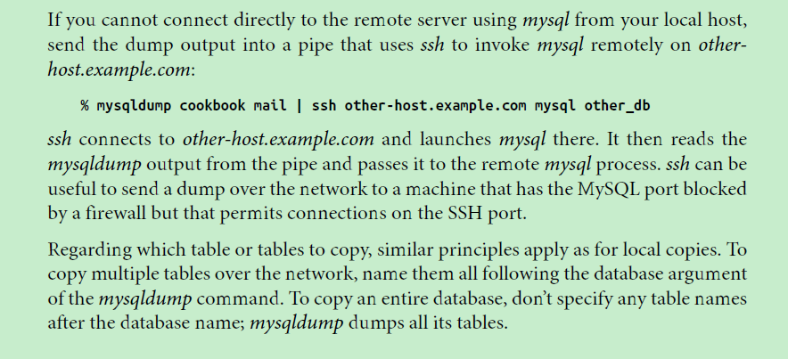

#MariaDB使用管道符和SSH進行跨服務器的表複製


擎天節度在之前的博文<[MariaDB使用管道符`|`進行跨庫、跨服務器的表複製](http://qingtianjiedu.com/blog/use-pipe-copy-tables-between-databases-or-servers-in-mariadb/)>測試了使用管道符`|`在本地服務器進行跨庫表複製和從遠程服務器複製表到本地服務器，但沒有測試從本地服務器複製表到遠程服務器。今天在進行數據庫從本地服務器複製到遠程VPS服務器時（沿襲之前的語句格式），出現了報錯，網路上也沒能找到可行的解決方案。

猛想起[Paul DuBois](http://www.oreilly.com/pub/au/330)的[[MySQL CookBook 3rd](http://shop.oreilly.com/product/0636920032274.do)]中[4.6. Copying a Table Using mysqldump]，有提到如果不能調用本地的mysql命令連接遠程服務器，可通過SSH調用遠程服務器上的mysql命令進行相關操作。遂測試了一下，果然成功實現數據複製。

---
[TOC]

---

##VPS相關信息
```
Last login: Sun Oct 18 02:27:58 2015 from 101.85.225.217

//服務器時間和時區
[root@tianyun ~]# date -R
Sun, 18 Oct 2015 02:30:59 -0400

//Linux發行版本查詢
[root@tianyun ~]# cat /etc/*-release
CentOS Linux release 7.1.1503 (Core)
NAME="CentOS Linux"
VERSION="7 (Core)"
ID="centos"
ID_LIKE="rhel fedora"
VERSION_ID="7"
PRETTY_NAME="CentOS Linux 7 (Core)"
ANSI_COLOR="0;31"
CPE_NAME="cpe:/o:centos:centos:7"
HOME_URL="https://www.centos.org/"
BUG_REPORT_URL="https://bugs.centos.org/"

CENTOS_MANTISBT_PROJECT="CentOS-7"
CENTOS_MANTISBT_PROJECT_VERSION="7"
REDHAT_SUPPORT_PRODUCT="centos"
REDHAT_SUPPORT_PRODUCT_VERSION="7"

CentOS Linux release 7.1.1503 (Core)
CentOS Linux release 7.1.1503 (Core)

//查詢系統內核版本
[root@tianyun ~]# uname -r
2.6.32-042stab108.8
[root@tianyun ~]# cat /proc/version
Linux version 2.6.32-042stab108.8 (root@kbuild-rh6-x64.eng.sw.ru) (gcc version 4.4.6 20120305 (Red Hat 4.4.6-4) (GCC) ) #1 SMP Wed Jul 22 17:23:23 MSK 2015

//測試讀寫性能
[root@tianyun ~]# dd if=/dev/zero of=test bs=64k count=4k oflag=dsync
4096+0 records in
4096+0 records out
268435456 bytes (268 MB) copied, 0.291668 s, 920 MB/s
[root@tianyun ~]# dd if=/dev/zero of=test bs=64k count=40k oflag=dsync
40960+0 records in
40960+0 records out
2684354560 bytes (2.7 GB) copied, 10.091 s, 266 MB/s

//查看磁盤信息
[root@tianyun ~]# df -lh
Filesystem      Size  Used Avail Use% Mounted on
/dev/simfs       43G  8.9G   35G  21% /
devtmpfs        512M     0  512M   0% /dev
tmpfs           512M     0  512M   0% /dev/shm
tmpfs           512M   56K  512M   1% /run
tmpfs           512M     0  512M   0% /sys/fs/cgroup
[root@tianyun ~]#

//連接VPS本地數據庫
[root@tianyun ~]# mysql -uroot -p
Enter password:
Welcome to the MariaDB monitor.  Commands end with ; or \g.
Your MariaDB connection id is 3
Server version: 10.1.8-MariaDB MariaDB Server

Copyright (c) 2000, 2015, Oracle, MariaDB Corporation Ab and others.

Type 'help;' or '\h' for help. Type '\c' to clear the current input statement.


//查詢數據庫版本
MariaDB [(none)]> select version();
+----------------+
| version()      |
+----------------+
| 10.1.8-MariaDB |
+----------------+
1 row in set (0.00 sec)

//數據庫用戶帳號
MariaDB [(none)]> select User,Host from mysql.user;
+------+-----------+
| User | Host      |
+------+-----------+
| root | 127.0.0.1 |
| root | ::1       |
| root | localhost |
+------+-----------+
3 rows in set (0.00 sec)

//查看當前登錄帳號授權信息
MariaDB [(none)]> show grants for current_user\G
*************************** 1. row ***************************
Grants for root@localhost: GRANT ALL PRIVILEGES ON *.* TO 'root'@'localhost' IDENTIFIED BY PASSWORD '*0D6006B4C5E08CE9759AD4EC225FBC2B0955180F' WITH GRANT OPTION
*************************** 2. row ***************************
Grants for root@localhost: GRANT PROXY ON ''@'%' TO 'root'@'localhost' WITH GRANT OPTION
2 rows in set (0.00 sec)

MariaDB [(none)]>
```

---

##創建數據庫帳號
因VPS中數據庫還沒有允許遠程登錄的用戶帳號，先創建帳號’tianyun’@’%’,權授權all privileges
並創建空數據庫diysystemTest

```sql
MariaDB [(none)]> grant all on *.* to 'tianyun'@'%' identified by '12345';            
Query OK, 0 rows affected (0.00 sec)

MariaDB [(none)]> select User,Host from mysql.user;                       
+---------+-----------+
| User    | Host      |
+---------+-----------+
| tianyun | %         |
| root    | 127.0.0.1 |
| root    | ::1       |
| root    | localhost |
+---------+-----------+
4 rows in set (0.00 sec)

MariaDB [(none)]> show grants for 'tianyun'@'%'\G                                       
*************************** 1. row ***************************
Grants for tianyun@%: GRANT ALL PRIVILEGES ON *.* TO 'tianyun'@'%' IDENTIFIED BY PASSWORD '*00A51F3F48415C7D4E8908980D443C29C69B60C9'
1 row in set (0.00 sec)

MariaDB [(none)]> flush privileges;
Query OK, 0 rows affected (0.00 sec)

MariaDB [(none)]> Ctrl-C -- exit!
Aborted

//使用tianyun登入數據庫
[root@tianyun ~]# mysql -utianyun -p
Enter password:
Welcome to the MariaDB monitor.  Commands end with ; or \g.
Your MariaDB connection id is 4
Server version: 10.1.8-MariaDB MariaDB Server

Copyright (c) 2000, 2015, Oracle, MariaDB Corporation Ab and others.

Type 'help;' or '\h' for help. Type '\c' to clear the current input statement.

MariaDB [(none)]> show databases;
+--------------------+
| Database           |
+--------------------+
| information_schema |
| mysql              |
| performance_schema |
+--------------------+
3 rows in set (0.00 sec)

//創建空數據庫diysystemTest
MariaDB [(none)]> create database if not exists diysystemTest;
Query OK, 1 row affected (0.00 sec)

MariaDB [(none)]> show databases;
+--------------------+
| Database           |
+--------------------+
| diysystemTest      |
| information_schema |
| mysql              |
| performance_schema |
+--------------------+
4 rows in set (0.00 sec)

//切換入數據庫diysystemTest
MariaDB [(none)]> use diysystemTest;
Database changed

//列出相關表，爲空
MariaDB [diysystemTest]> show tables;
Empty set (0.00 sec)

MariaDB [diysystemTest]>
```

---
##本地服務器數據庫信息
```sql
Last login: Sun Oct 18 11:35:35 2015 from 192.168.1.6
[flying@localhost ~]$ su
Password:
[root@localhost flying]# mysql -uroot -p
Enter password:
Welcome to the MariaDB monitor.  Commands end with ; or \g.
Your MariaDB connection id is 3
Server version: 10.1.7-MariaDB MariaDB Server

Copyright (c) 2000, 2015, Oracle, MariaDB Corporation Ab and others.

Type 'help;' or '\h' for help. Type '\c' to clear the current input statement.

MariaDB [(none)]> select version();
+----------------+
| version()      |
+----------------+
| 10.1.7-MariaDB |
+----------------+
1 row in set (0.00 sec)

MariaDB [(none)]> show databases;
+--------------------+
| Database           |
+--------------------+
| bi                 |
| diysystem          |
| ds                 |
| information_schema |
| isnapp             |
| mysql              |
| performance_schema |
+--------------------+
7 rows in set (0.08 sec)

MariaDB [(none)]>
```

---
##Try1
將本地數據庫diysystem複製到VPS遠程數據庫（之前的方法，報錯）

```sql
//相關帳號信息以XXX代替
[root@localhost flying]# mysqldump -uroot -pXXX diysystem | mysql -utianyun -p -hXXX -PXXX diyststemTest
Enter password:
ERROR 2013 (HY000): Lost connection to MySQL server at 'reading initial communication packet', system error: 0 "Internal error/check (Not system error)"
mysqldump: Got errno 32 on write
[root@localhost flying]#
```

###出現報錯
```
ERROR 2013 (HY000): Lost connection to MySQL server at ‘reading initial communication packet’, system error: 0 “Internal error/check (Not system error)”

mysqldump: Got errno 32 on write
```
關於該報錯信息，日後專門討論，暫且按下不表。

---

##Try2
將本地數據庫diysystem複製到VPS遠程數據庫（通過SSH）
```
mysqldump -uroot -pXXX database_name | ssh xxx@XXX -pXXX mysql -utianyun -pXXX database_name
```

```sql
//複製命令，相關帳號信息以XXX代替
[root@localhost flying]# mysqldump -uroot -p12345 diysystem | ssh root@23.252.111.143 -p27028 mysql -utianyun -p12345
root@23.252.111.143's password:
ERROR 1046 (3D000) at line 22: No database selected
[root@localhost flying]# mysqldump -uroot -pXXX diysystem | ssh root@XXX -pXXX mysql -utianyun -pXXX diysystemTest        
root@23.252.111.143's password:

//ssh登錄VPS
[root@localhost flying]# ssh root@XXX -pXXX
root@23.252.111.143's password:
Last login: Sun Oct 18 02:30:23 2015 from 101.85.225.217

//登錄VPS後，登錄該服務器上的數據庫
[root@tianyun ~]# mysql -utianyun -p
Enter password:
Welcome to the MariaDB monitor.  Commands end with ; or \g.
Your MariaDB connection id is 10
Server version: 10.1.8-MariaDB MariaDB Server

Copyright (c) 2000, 2015, Oracle, MariaDB Corporation Ab and others.

Type 'help;' or '\h' for help. Type '\c' to clear the current input statement.

//列出所有數據庫
MariaDB [(none)]> show databases;
+--------------------+
| Database           |
+--------------------+
| diysystemTest      |
| information_schema |
| mysql              |
| performance_schema |
+--------------------+
4 rows in set (0.01 sec)

//切換到數據庫diysystemTest
MariaDB [(none)]> use diysystemTest;
Reading table information for completion of table and column names
You can turn off this feature to get a quicker startup with -A

Database changed

//列出相關表
MariaDB [diysystemTest]> show tables;
+-------------------------+
| Tables_in_diysystemTest |
+-------------------------+
| cut_job                 |
| match_history           |
| match_hrs_log           |
| match_hrs_map           |
| match_log               |
| member                  |
| member_signlog          |
| pack_hub                |
| product                 |
| product_img             |
| product_tag             |
| rec_hub                 |
| sys_menu                |
| sys_use_menu            |
| train_hub               |
| train_job               |
| train_menu              |
+-------------------------+
17 rows in set (0.00 sec)

//查詢表member_signlog中記錄數
MariaDB [diysystemTest]> select count(*) from member_signlog;
+----------+
| count(*) |
+----------+
|       43 |
+----------+
1 row in set (0.00 sec)

//退出數據庫登錄
MariaDB [diysystemTest]> Ctrl-C -- exit!
Aborted

//退出VPS登錄
[root@tianyun ~]# exit
logout
Connection to 23.252.111.143 closed.
[root@localhost flying]#
```

---
##相關博文
[MariaDB使用管道符`|`進行跨庫、跨服務器的表複製](http://qingtianjiedu.com/blog/use-pipe-copy-tables-between-databases-or-servers-in-mariadb/)



---
**Note Time**：2015.10.18 15:45 Sunday 上海 松江

---

`Blog Url`:<http://qingtianjiedu.com/blog/use-pipe-and-ssh-copy-tables-between-servers-in-mariadb/>
`Release Time`:2015-10-18
`BackUpTime`:2015.11.09 10:43
